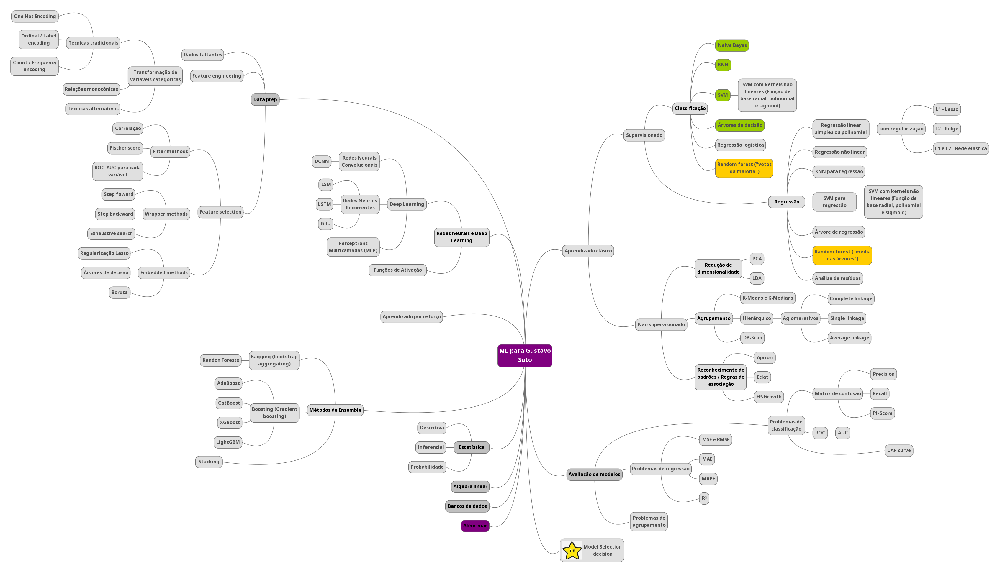

# Minhas anotações do curso

O material disponibilizado nesse repositório são anotações e exercícios do curso do Professor Jones Granatyr (Udemy), além de alguns testes meus com base nos modelos ensinados em aula.

## Organização

Os arquivos encontram-se em Jupyter Notebooks por ser a maneira mais didática de observar o que está ocorrendo em cada etapa da análise ou implementação do modelo.

- Seção 01 - Métricas de avaliação de modelos

**Parte 01 - Classificação**

- Seção 01 - Métricas de avaliação de modelos

- Seção 04 - Aprendizagem Bayesiana (Análise de crédito)

- Seção 04 - Aprendizagem Bayesiana

- Seção 05 - Aprendizagem por random forests (base crédito)

- Seção 05 - Aprendizagem por árvores de decisão (Análise de crédito)

- Seção 05 - Aprendizagem por árvores de decisão (Análise de crédito-sem escalonamento)

- Seção 05 - Aprendizagem por árvores de decisão (Censo)

- Seção 07 - Aprendizagem baseada em instâncias (KNN)

- Seção 09 - Support Vector Machines (base censo)

- Seção 09 - Support Vector Machines (base crédito)

- Seção 10 - Redes Neurais Artificiais

**Parte 02 - Regressão**

- Seção 14 - Regressão Linear Simples

- Seção 14 - Regressão Linear (Desafio_Auto Imports Database)

**Parte 03 - Regras de associação**

- Seção 17 - Regras de associação - Algoritmo apriori

**Parte 04 - Agrupamento**

- Seção 20 - Agrupamento com K-means e K-medians (Análise de crédito)

- Seção 20 - Agrupamento com K-means++ (Análise de crédito)

**Parte 05 - Além-mar**

- Seção 25 - Detecção de outliers

Por fim, para facilitar (para mim), uso um mapa, que está em constante preenchimento, para **navegar**. =)

